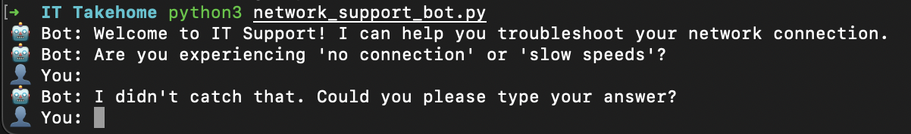
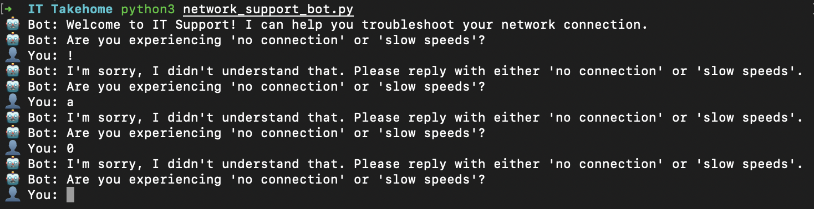
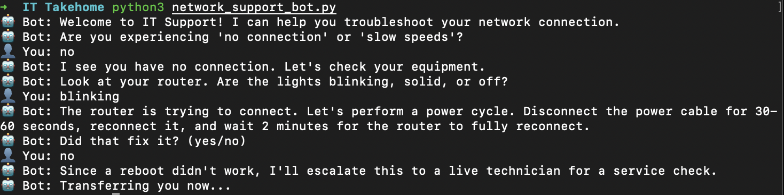
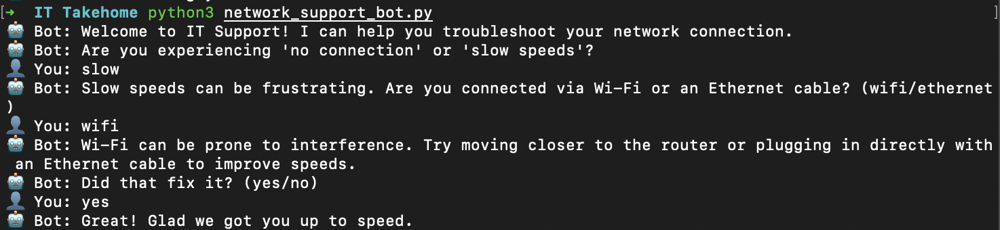

# IT Support Chatbot Prototype

## Overview
This is a Python-based command-line interface (CLI) chatbot prototype designed to handle a high-volume Tier 1 IT support scenario: **Internet Connection Troubleshooting**. 

The bot uses a deterministic decision tree to quickly categorize user issues into physical layer faults (power/equipment) or local network layer issues (Wi-Fi/Ethernet). It focuses on providing a smooth, logical flow with robust error handling for unpredictable user inputs, ensuring no "dead ends" in the customer journey.

## Key Design Choices & Technical Features
* **Substring Matching:** Instead of forcing users to type rigid commands, the bot looks for keywords *within* the user's input, and routes the conversation to the best match. 
* **Isolated Error Trapping:** Utilizing a dedicated `get_yes_no()` helper function and persistent `while True` loops ensures the user is never dropped from the conversation due to an empty response or a typo. The bot will gently prompt them until a valid parameter is given.
* **Zero Dead Ends:** If a troubleshooting step fails, the logic explicitly catches the failure and routes the user to a live agent or field technician, mirroring a true enterprise escalation path.
* **Conversational UX:** Implemented a custom `sys.stdout` typing animation (`. . .`) to simulate network delay and natural bot processing, making the CLI feel highly conversational.

## Setup & Installation

1.  **Prerequisites:** Ensure you have Python 3.x installed on your machine.
2.  **Clone the Repository:**
    ```bash
    git clone https://github.com/guyjrosenberg/Network-Support-Bot.git
    cd Network-Support-Bot
    ```
3.  **Run the Application:**
    No external libraries or dependencies are required. Simply run the script natively from your terminal:
    ```bash
    python network_support_bot.py
    ```

## Usage Examples
* **Handling Unrecognized & Empty Inputs:**
  
  

* **Successful Troubleshooting & Escalation Flow:**
  
  
